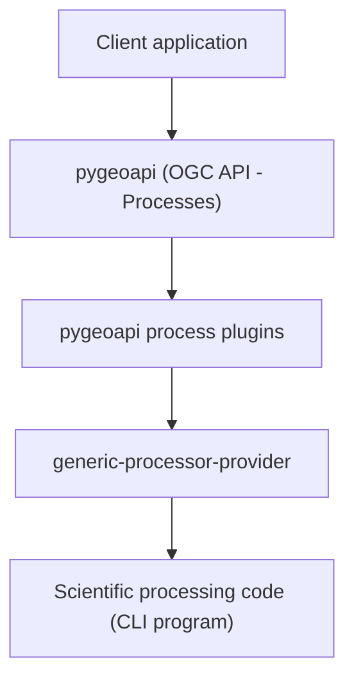

# INGV generic processor provider for pygeoapi plugins

[](https://doi.org/10.5281/zenodo.18892842)


Lightweight **generic processor provider**, acting as an **execution service**,
used by the INGV pygeoapi processing platform
to run scientific command‑line programs requested through **OGC API - Processes**
services implemented with **pygeoapi**.

---

## Overview

This repository contains a **Flask web application** implementing an
execution service used by the **INGV pygeoapi process plugins**.

The execution service receives execution requests from pygeoapi plugins via HTTP APIs,
invokes a configured application code through the command line,
and returns the execution status and results.

The project acts as the **execution layer** of the platform architecture, while:

- **pygeoapi** exposes OGC API - Processes endpoints
- **pygeoapi plugins** manage process logic and job requests
- **this service** executes the actual scientific processing code

Execution takes place in a dedicated execution environment, enabling:

- isolation of runtime environments
- independent management of software dependencies
- flexible deployment across different machines

---

## Design principles

The execution service design follows several principles:

- **Minimal execution service** – focused only on executing command‑line applications
- **Environment isolation** – scientific codes can run on dedicated machines
- **Generic execution model** – any CLI program can be executed without modifying the service
- **Decoupled architecture** – API infrastructure and execution environments remain independent

---

## Architecture diagram



---

## Execution workflow

1. A client sends a processing request to **pygeoapi**.
2. The corresponding **pygeoapi plugin** receives the request.
3. The plugin sends an HTTP request to the **generic processor provider**.
4. The provider executes the configured command‑line program.
5. The provider collects execution results and job status.
6. Results are returned to the plugin and exposed through the API.

---

## Platform components

| Component | Repository | DOI | Role |
|-----------|------------|-----|------|
| processing platform | [ingv-pygeoapi-processing-platform](https://github.com/francescoingv/ingv-pygeoapi-processing-platform) | https://doi.org/10.5281/zenodo.18892848 | platform architecture |
| pygeoapi process plugins | [ingv-pygeoapi-process-plugins](https://github.com/francescoingv/ingv-pygeoapi-process-plugins) | https://doi.org/10.5281/zenodo.18892819 | OGC API process implementation |
| execution service | [generic-processor-provider](https://github.com/francescoingv/generic-processor-provider) | https://doi.org/10.5281/zenodo.18892842 | remote execution service |

---

## Processing codes

The service executes external scientific processing codes configured
through the `command_line` parameter defined in `application.ini`.

Examples of scientific codes executed through the platform:

- **pybox** – scientific processing model to simulate the dispersals
  of a gravity-driven pyroclastic density current (PDC)
  
  Repository: https://github.com/silviagians/PyBOX-Web
  DOI: https://doi.org/10.5281/zenodo.18920969

- **conduit** – scientific processing model for computing the one-dimensional,
  steady, isothermal, multiphase and multicomponent flow of magma
  in volcanic conduits

- **solwcad** – scientific processing model to compute the saturation surface of
  H₂O–CO₂ fluids in silicate melts of arbitrary composition

These codes are not part of this repository and must be installed
separately depending on the deployment environment.

---

## Configuration

The execution service configuration is defined by the following files.

### Configuration files

The main configuration files of the execution service are:

- `va_simple_provider/application.ini`
- `va_simple_provider/database.ini`
- `va_simple_provider/logging.cfg`

### `application.ini`

Defines application parameters and the command used to execute the code.

Main parameters:

- `max_allowed_parameter_len` - maximum length of a parameter name
- `max_allowed_request_body_size` - maximum size of the HTTP request body
- `id_service` - identifier of the service
- `command_line` - command used to execute the application code
- `suppress_stdout` - indicates whether the standard output of the process must be suppressed
- `file_root_directory` - directory used for input and output files

### `database.ini`

Defines PostgreSQL connection parameters used for storing job information.

Example:

```ini
[postgresql]
host=127.0.0.1
port=5433
database=ogc_api
user=ogc_api_user
password=user
```

### Database schema

The execution service requires a PostgreSQL schema to store job execution data.

The schema is provided in:

```text
postgresql_schema.backup.sql
```

Before starting the service, the database must be created and the
schema imported.
To import the schema:


```bash
psql -U ogc_api_user -d ogc_api -f postgresql_schema.backup.sql
```

The schema creates the main tables used by the service:

- `request`
- `request_parameter`

The `request` table stores information about received jobs and their
execution status.

The `request_parameter` table stores parameters associated with each
request.

The user configured in `database.ini` must have access permissions
to the tables and sequences defined in the schema.

---

## Service API

### Execute a job

```text
POST /execute
```

The request body must contain a JSON object describing the execution parameters
sent by the pygeoapi plugin when invoking the execution service.

The detailed request structure is described in the plugin documentation:

https://github.com/francescoingv/ingv-pygeoapi-process-plugins#external-processing-service-interface

### Job information

```text
GET /job_info/<job_id>
```

Returns the execution status and job information.

---

## Project structure

```text
generic-processor-provider/
├── requirements.txt
├── postgresql_schema.backup.sql
├── va_simple_provider/
│   ├── __init__.py
│   ├── application.ini
│   ├── database.ini
│   ├── logging.cfg
│   ├── views.py
│   ├── db_utils.py
│   ├── custom_exceptions.py
│   └── controllers/
│       └── code_handler.py
└── README.md
```

---

## Docker deployment

The repository can be deployed using Docker.

Default service port:

```
5000
```

---

## Requirements

Main runtime dependencies:

- Python ≥ 3.12
- Flask
- PostgreSQL
- psycopg2
- virtualenv / venv-run

Python dependencies are defined in:

```
requirements.txt
```

---

## Related projects

This repository is a component of the **INGV pygeoapi processing platform**.

The platform consists of the following main software components:

- **Processing platform**
  https://github.com/francescoingv/ingv-pygeoapi-processing-platform
  DOI: https://doi.org/10.5281/zenodo.18892848

- **pygeoapi process plugins**
  https://github.com/francescoingv/ingv-pygeoapi-process-plugins
  DOI: https://doi.org/10.5281/zenodo.18892819

The **pygeoapi plugins** expose processing services through the
**OGC API - Processes** standard and forward execution requests to
the **generic processor provider**, which executes the configured
scientific application code.

Together these components implement the architecture of the
**INGV pygeoapi processing platform**.

---

## Citation

Martinelli, F. (2026).
*Generic processor provider for external execution services used by
INGV pygeoapi process plugins*.
DOI: https://doi.org/10.5281/zenodo.18892842

---

## License

This project is distributed under the **MIT License**.

See the `LICENSE` file for details.

---

## Authors

Francesco Martinelli
Istituto Nazionale di Geofisica e Vulcanologia (INGV)
Pisa, Italy

---

## Acknowledgements

Developed at the **Istituto Nazionale di Geofisica e Vulcanologia (INGV)**.

